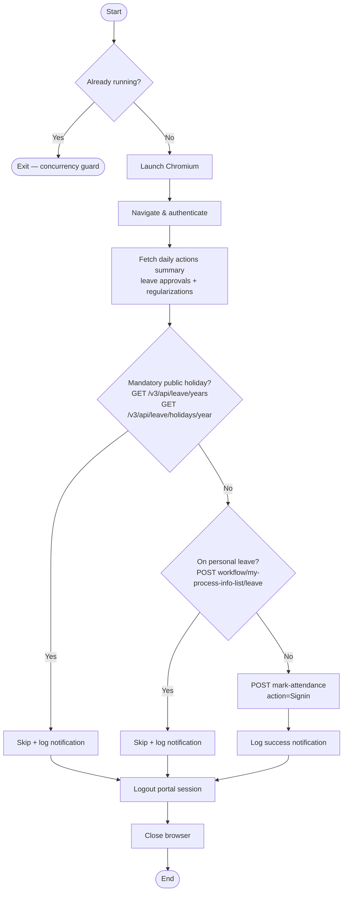
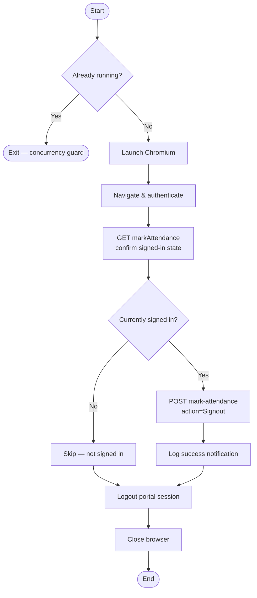

# Auto Login Automation

This project automates the login, logout, and attendance workflows for the GreytHR portal using Playwright and Node.js. It supports two runtime modes: a **cron scheduler** for persistent self-hosted deployments, and a **REST API server** for stateless cloud deployments (Cloud Run, ECS, etc.).

## Features

- **Automated Login/Logout**: Authenticates with the GreytHR portal and marks attendance check-in/check-out via the portal's internal REST API.
- **Dual Runtime Modes**: Run as a persistent cron scheduler (`MODE=cron`) or a stateless Express REST API (`MODE=server`) — same image, different config.
- **REST API with Authentication**: Exposes `/login`, `/logout`, and `/health` endpoints secured with an `x-api-key` header. Designed for external schedulers (Cloud Scheduler, EventBridge, etc.).
- **Fire-and-Forget API**: HTTP responses are returned immediately (202 Accepted); Playwright workflows run asynchronously in the background, keeping latency under any cloud timeout.
- **Public Holiday Detection**: Before marking attendance, the application queries the GreytHR holidays API (`/v3/api/leave/years` + `/v3/api/leave/holidays/{year}`) to automatically skip check-in on mandatory (non-restricted) public holidays.
- **Personal Leave Detection**: Checks the employee's leave workflow (Pending and History tabs) and skips attendance if the user has an active leave today.
- **API-First Automation**: All attendance and leave/holiday checks use `page.evaluate(fetch())` to call GreytHR's internal REST APIs directly inside the authenticated browser context, avoiding fragile DOM traversal wherever possible.
- **Headless Mode**: Supports headless mode (default for Docker/server) or headed mode for local debugging.
- **Secure Configuration**: Uses `@dotenvx/dotenvx` for encrypted environment variable management.
- **Notifications**: Logs success/failure events to console and log files. Pluggable notifier stub (`services/notifier.ts`) ready for a push channel when chosen.
- **Email Alerts**: SMTP failure emails with screenshot attachments for attendance API errors.

## Prerequisites

- Node.js (v18 or higher)
- Docker & Docker Compose (optional, for containerised execution)

## Setup

1. **Clone the repository:**
   ```bash
   git clone <repository_url>
   cd auto-login
   ```

2. **Install dependencies:**
   ```bash
   npm install
   ```

3. **Configure Environment Variables:**
   Copy the example environment file or create a new `.env` file:
   ```bash
   cp .env.example .env
   ```

   Fill in the following details in your `.env` file:

   | Variable | Required | Description | Example |
   | :--- | :--- | :--- | :--- |
   | `GREYTHR_URL` | Yes | Base URL of your GreytHR portal | `https://example.greythr.com` |
   | `GREYTHR_USERNAME` | Yes | Your GreytHR employee username | `EMP123` |
   | `GREYTHR_PASSWORD` | Yes | Your GreytHR password (plain text; the browser encrypts it before sending) | `password123` |
   | `MODE` | No | Runtime mode: `server` (REST API) or `cron` (scheduler). Defaults to `cron`. | `server` |
   | `API_KEY` | In server mode | Secret key clients must send in the `x-api-key` header | `a-long-random-secret` |
   | `PORT` | No | Port the Express server listens on. Defaults to `8080`. | `8080` |
   | `LOGIN_TIME` | In cron mode | Cron expression for the daily check-in run | `0 9 * * 1-5` (9:00 AM Mon–Fri) |
   | `LOGOUT_TIME` | In cron mode | Cron expression for the daily check-out run | `0 18 * * 1-5` (6:00 PM Mon–Fri) |
   | `HEADLESS` | No | Run Chromium in headless mode (`true`/`false`) | `true` |
   | `SMTP_HOST` | No | SMTP server hostname for failure email alerts | `smtp.gmail.com` |
   | `SMTP_PORT` | No | SMTP server port (`587` for STARTTLS, `465` for TLS) | `587` |
   | `SMTP_USER` | No | SMTP authentication username | `user@example.com` |
   | `SMTP_PASS` | No | SMTP authentication password or app password | `apppassword` |
   | `SMTP_FROM` | No | Sender address shown in failure emails | `alerts@example.com` |
   | `SMTP_TO` | No | Recipient address for failure emails | `you@example.com` |

## Encryption with Dotenvx

This project uses [dotenvx](https://dotenvx.com/) to keep credentials encrypted at rest.

### Encrypting your .env file
```bash
npx dotenvx encrypt
```
This produces an encrypted `.env` and a `.env.keys` file with the decryption key.

### Decrypting / inspecting values
```bash
npx dotenvx get GREYTHR_PASSWORD
# or decrypt the whole file locally (do not commit the result)
npx dotenvx decrypt
```

### Running with encrypted env
The application automatically decrypts values at startup using the key in `.env.keys` or the `DOTENV_PRIVATE_KEY` environment variable. Set `DOTENV_PRIVATE_KEY` in your Docker or CI environment to avoid shipping the `.env.keys` file.

## Runtime Modes

### Cron Mode (self-hosted / persistent VM)

The application runs indefinitely and triggers login/logout on the configured cron schedule. Suitable for a local machine, a VM, or a Docker container that runs 24/7.

```
MODE=cron  (default)
Requires: LOGIN_TIME, LOGOUT_TIME
```

### Server Mode (stateless / cloud)

The application starts an Express HTTP server and exposes endpoints that an external scheduler (Cloud Scheduler, AWS EventBridge, etc.) calls at the desired times. The container does not need to run continuously — cloud services like Cloud Run or ECS can scale it to zero between invocations, and the scheduler wakes it up on demand.

```
MODE=server
Requires: API_KEY
Optional: PORT (default 8080)
```

The Docker image defaults to `MODE=server` for cloud deployments. Override with `MODE=cron` for self-hosted use.

## REST API

All endpoints are available in `MODE=server`. The `/health` endpoint requires no authentication; all other endpoints require an `x-api-key` header.

### `GET /health`

Liveness check used by Cloud Run / ECS health probes. No authentication required.

```bash
curl https://your-service/health
```

```json
{ "status": "ok", "timestamp": "2026-04-03T09:00:00.000Z" }
```

### `POST /login`

Triggers the attendance check-in flow. Returns immediately with `202 Accepted`; the Playwright workflow runs in the background.

```bash
curl -X POST https://your-service/login \
  -H "x-api-key: your-secret-key"
```

```json
{ "message": "Login flow started." }
```

### `POST /logout`

Triggers the attendance check-out flow. Same fire-and-forget behaviour as `/login`.

```bash
curl -X POST https://your-service/logout \
  -H "x-api-key: your-secret-key"
```

```json
{ "message": "Logout flow started." }
```

Concurrent requests to the same endpoint are safe — the existing concurrency guard (`loginRunning` / `logoutRunning`) skips a second trigger if the first flow is still in progress.

## How It Works

### Login Flow (`--login` / `POST /login` / scheduled)



### Logout Flow (`--logout` / `POST /logout` / scheduled)



### Public Holiday Logic

The application queries two GreytHR API endpoints:

- `GET /v3/api/leave/years` — returns `currentYear` (the starting year of the current fiscal year; GreytHR uses an April–March fiscal calendar).
- `GET /v3/api/leave/holidays/{year}` — returns all holidays for that fiscal year.

Attendance is skipped only for holidays where **both** conditions hold:
- `showHoliday: true` — the holiday is active and visible in the portal.
- `restricted: false` — it is a **mandatory** public holiday (office closed for everyone).

Holidays with `restricted: true` are optional; employees choose to take them. If taken, they appear as an approved leave in the workflow API and are caught by the personal leave check instead.

### Notification Summary

| Event | Channel | Message |
| :--- | :--- | :--- |
| Check-in successful | Log ✅ | "Attendance check-in completed successfully." |
| Check-out successful | Log ✅ | "Attendance check-out completed successfully." |
| Skipped — public holiday | Log ✅ | "Today is a public holiday: {name}. Skipped." |
| Skipped — on leave | Log ✅ | "User is on leave today. Skipped." |
| Login/logout flow failed | Log ❌ | Error message with timestamp |
| Attendance API failed | Log ❌ + Email 📧 | Error message + screenshot attachment |

## Usage

### Local Execution (TypeScript source)

```bash
# Start the cron scheduler (runs indefinitely)
npx ts-node index.ts

# Start the REST API server locally
npx ts-node index.ts --server
# or: MODE=server npx ts-node index.ts

# Manual check-in now
npx ts-node index.ts --login

# Manual check-out now
npx ts-node index.ts --logout

# Verify the portal is reachable
npx ts-node index.ts --health
```

### Docker Execution

```bash
# Build and start in the background (defaults to MODE=server)
docker-compose up --build -d

# Run in cron mode (self-hosted)
docker run -e MODE=cron -e LOGIN_TIME="0 9 * * 1-5" -e LOGOUT_TIME="0 18 * * 1-5" ... auto-login

# Tail logs
docker-compose logs -f

# Stop and remove the container
docker-compose down
```

### Cloud Deployment (Cloud Run / ECS)

1. Build and push the image — the Dockerfile defaults to `MODE=server`.
2. Set the following environment variables in your cloud service:
   - `API_KEY` — the secret your scheduler will send.
   - `DOTENV_PRIVATE_KEY` — decryption key for your encrypted `.env` (if used).
   - All GreytHR credentials.
3. Configure your external scheduler (Cloud Scheduler, EventBridge) to call:
   - `POST /login` at check-in time with header `x-api-key: <API_KEY>`
   - `POST /logout` at check-out time with header `x-api-key: <API_KEY>`

## Development

- **Headed mode**: Set `HEADLESS=false` in `.env` to watch the browser during development.
- **Status log**: `logs/login-status.log` — every state transition and API outcome.
- **Error log**: `logs/login-error.log` — all caught errors with full stack traces.
- **Screenshots**: `logs/ss/` — captured automatically on any API or navigation failure.

## Build Process

This project uses [esbuild](https://esbuild.github.io/) to compile and bundle TypeScript into a single optimised JavaScript file.

```bash
npm run build
```

The build script runs a TypeScript type-check first, then bundles everything into `dist/index.js`. External packages (`playwright`, `nodemailer`, etc.) are excluded from the bundle to keep the output small.

```bash
# Run the compiled output
node dist/index.js

# or
npm start
```

## Architecture

```
index.ts                   ← Entry point: CLI flags, mode selection, cron scheduler
config/
  env.ts                   ← Environment validation, AppConfig object
services/
  server.ts                ← Express REST API (/health, /login, /logout) with x-api-key auth
  auth.ts                  ← Playwright login / logout (UI)
  attendance.ts            ← Attendance check-in / check-out (API)
  leaveService.ts          ← Public holiday check (API) + personal leave check (API + interception)
  logService.ts            ← File-based status and error logging
  notifier.ts              ← Notification stub (console/log; swap in a push channel here)
  mailer.ts                ← SMTP failure emails with screenshot attachments
logs/
  login-status.log         ← Timestamped status trail
  login-error.log          ← Timestamped error trail
  ss/                      ← Failure screenshots
```
